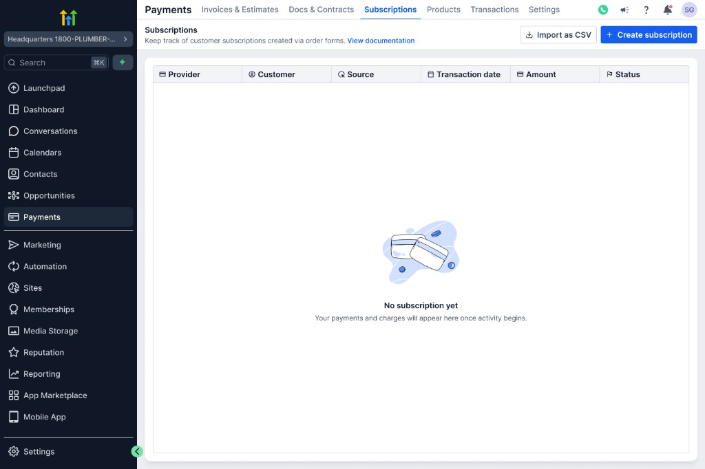
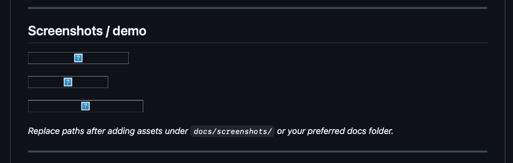
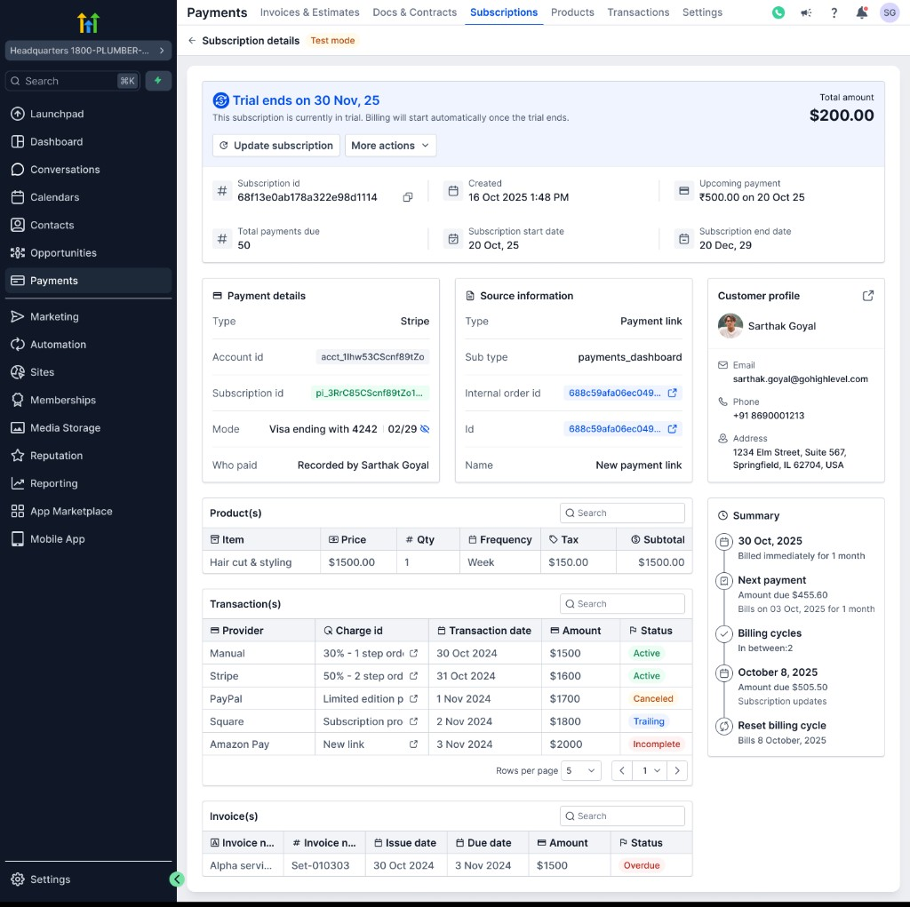
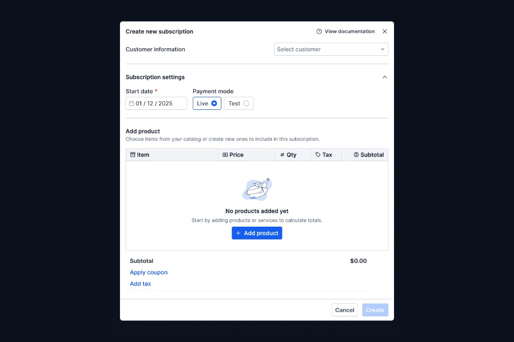
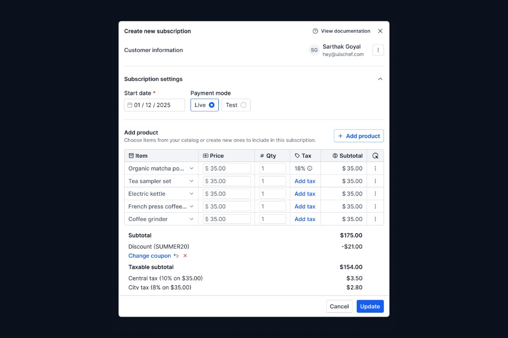
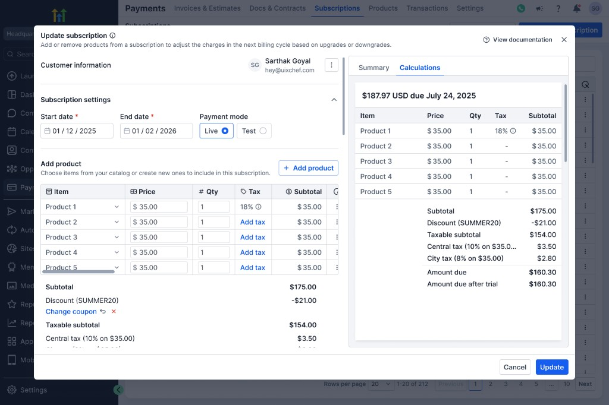
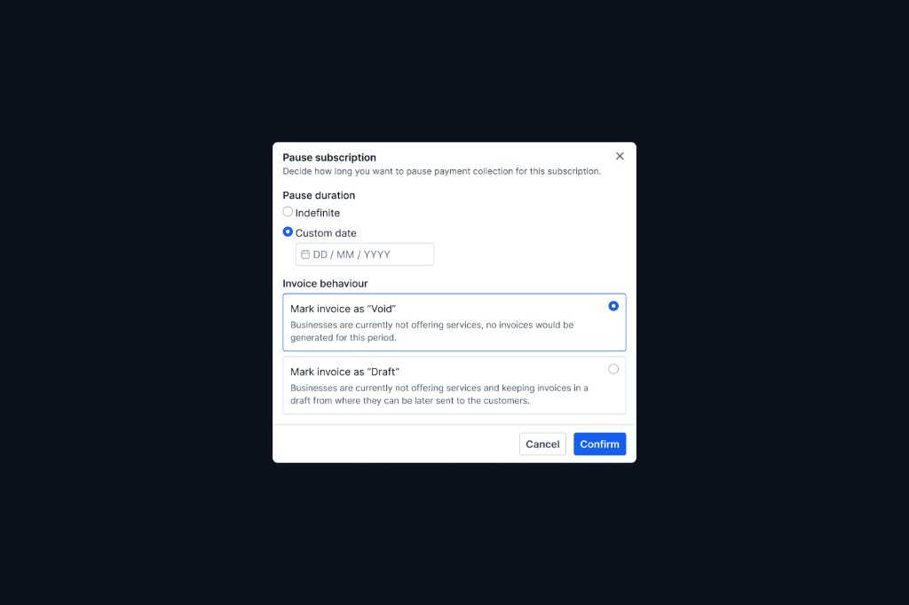
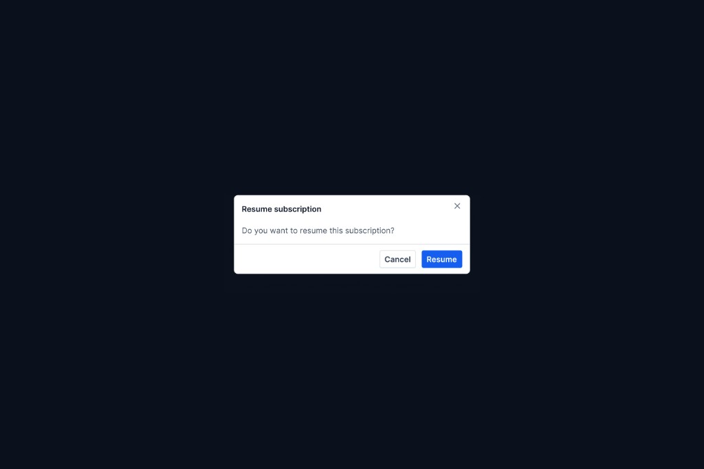
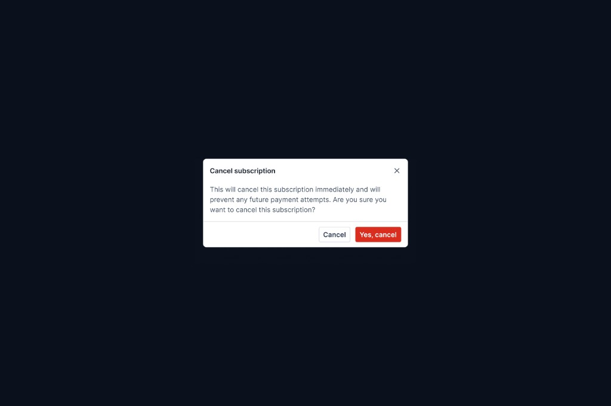

# HighLevel subscriptions — system rebuild

**A ground-up redesign of the subscriptions product** for HighLevel: not a patch on legacy flows, but a coherent subscription system spanning dashboard, lifecycle management, and billing-adjacent controls—built to the standard expected of modern SaaS billing surfaces (clarity, previewability, and safe handling of money-moving actions).

The attached PRDs cover important depth (proration, charge-date moves, coupon changes, automated cancellation). They are **supporting artifacts**. The actual scope is broader: full **subscription dashboard**, **subscription details**, **create / update / cancel / pause** flows, **advanced filtering**, and resilient **state handling** across long-running management tasks.

---

## Why this system exists

**Traditional subscription UIs often fail in three ways:**

1. **Inflexibility** — Charge alignment, coupons, and lifecycle outcomes are treated as one-off exceptions, forcing cancellations and recreations instead of in-place correction.
2. **Opaque billing actions** — Complex updates (mid-cycle product changes, date moves) lack previews and clear rules, so operators guess—or open tickets.
3. **Operational debt** — Refunds, manual adjustments, and support escalations replace **first-class product behavior** (proration, credits, forward-dated coupon impact, scheduled cancellation).

**This system exists to replace that debt with explicit rules, visible outcomes, and flows that match how recurring revenue actually behaves**—from first subscription through change, pause, resume, and end-of-life—manual or automated.

---

## System overview

The rebuild treats subscriptions as **managed objects** with a full lifecycle:

| Phase | What the system covers |
|--------|-------------------------|
| **origination** | Create subscription with correct line items, tax posture, and payment context |
| **observation** | Dashboard and detail views with scannable status and drill-down |
| **modification** | Deep update flows (products, quantities, dates, coupons, proration posture) |
| **interruption** | Pause and resume without losing the mental model of “what happens next” |
| **termination** | Cancel now vs scheduled / end-of-cycle, including automation at account level |
| **governance** | Filters and state that stay honest as volume and edge cases grow |

The PRD-backed capabilities (proration, charge date, coupon modification, auto-cancellation setting) **slot into this lifecycle** as precision instruments—not isolated features.

---

## Core product flows

### Create subscription

Establishes the subscription with the right **defaults and guardrails** so later updates are deltas, not rescue missions. Creation is the contract: what is sold, how it bills, and under which tax/coupon assumptions.

### Update subscription *(primary complexity surface)*

Where most systems leak. This flow is designed for **stacked changes** with:

- **Billing previews** before commit (next charge, future recurring, and—where applicable—proration lines).
- **Explicit toggles and modes** (e.g. proration on vs off; immediate vs next-cycle settlement) so behavior is never implicit.
- **Charge date rescheduling** as a first-class anchor move: charges due before the new date still run; the cycle resets on the selected date; frequency continues from the new anchor—reducing “cancel and recreate” workflows.

Supporting PRD depth includes **coupon modification** (add / remove / replace) with **forward-only financial impact**—past transactions and the original order stay intact; previews show updated next and future charges.

### View subscription details

A **single source of truth** in the UI: status, payment context, line items, and transaction history—aligned with what update and cancel flows assert, so operators never fight two different stories.

### Pause / resume

Pause is modeled as a **lifecycle state** with clear user messaging (what stops, what resumes, and what billing previews imply). Resume reconnects the operator to the same detail and update surfaces without ambiguity.

### Cancel

Supports **immediate** cancellation paths and **scheduled / end-of-cycle** outcomes. Complements **account-level auto cancellation** (see advanced capabilities): when enabled, subscriptions can terminate automatically at cycle or scheduled end—reducing manual dashboard/API churn.

### Dashboard & filtering

The dashboard is built for **volume and triage**: find the right subscription quickly, trust filters and state, and jump into detail or update without losing context. Advanced filters and state handling are first-class so the UI stays usable as the account grows.

**Edge cases surfaced in product scope (non-exhaustive):**

- Proration on product, quantity, and charge-date changes—with optional timing of charge (cycle vs immediate); taxes on prorated amounts; credits as applied balance; **no** proration trigger for coupon-only edits (by design).
- Charge date changes with **future-only** selection, preview of charges before and after the anchor, and lifecycle rules once the anchor date is reached (including subsequent edits via dedicated affordances).
- Coupon updates with **preview of next and recurring** charges; redundant remove/re-add of the same code does not create noise.
- Pause interactions that do not pretend billing is “paused” in ambiguous ways—copy and previews carry the burden.
- Destructive flows (cancellation, irreversible automation) with **clear subcopy and tooltips** where the product demands it.

---

## Advanced capabilities

| Capability | Role in the system |
|------------|---------------------|
| **proration** | Mid-cycle accuracy when products, quantities, or charge dates change—optional, toggleable, with immediate vs next-cycle settlement and tax-aware lines. |
| **charge date rescheduling** | Moves the billing anchor without rewriting history; previews show continuity across the transition. |
| **coupon modification** | Business agility post-creation: changes affect **upcoming and future** charges only; preview-driven transparency. |
| **auto cancellation setting** | Central control to end subscriptions at **end of billing cycle** or **scheduled end date**, with explicit irreversibility and API alignment—reducing one-off manual cancels. |

---

## UX & product thinking

- **Complexity is pushed into structured surfaces**—update is one modal system with sections, not a dozen disconnected dialogs.
- **Previews and helper text** carry the economics: users see *what will happen* before it happens.
- **Guardrails on irreversible actions**—cancellation and automation copy state consequences plainly (including pending payment realities where scoped).
- **Trade-offs are explicit**—e.g. coupon edits don’t trigger proration logic; proration is opt-in by default; auto-cancel is off by default. Defaults favor predictability; power sits behind clear controls.

---

## System architecture

- **Component architecture** — feature modules under a hub shell (`payment-hub`) and domain folders (`subscriptions`) separate **chrome** (nav, layout, toasts) from **flows** (create, update, detail, pause, cancel).
- **State** — Client-side state is organized around **subscription rows**, **user-created snapshots**, and **update hydration** so modals re-open with coherent context (line items, coupon, tax selections). The pattern scales to API-backed sources by swapping persistence boundaries.
- **API interactions** — Flows are structured to align with **subscription management** and **payments/transactions** contracts (create/update/cancel, previews, logging). Provider diversity (e.g. Stripe, PayPal, custom) is assumed at the platform layer; the UI keeps **parity between displayed previews and server intent**.
- **Separation of concerns** — **presentation** (tables, modals, banners) vs **domain helpers** (validation, postal/phone rules, tax catalogs, pagination) vs **persistence adapters**—so billing rules can evolve without rewriting every screen.

---

## Scalability & extensibility

- **Multiple payment providers** — Row model and UI patterns treat provider as data, not as a forked UI per gateway.
- **High subscription volume** — Dashboard and filtering are built for scan-and-drill workflows; tables and toolbars avoid one-off pagination hacks.
- **Future billing features** — New capabilities plug in as **additional update sections**, **settings toggles**, or **preview line types** without re-architecting the shell.

---

## Tech stack

| Technology | Purpose |
|------------|---------|
| **Next.js** (App Router) | Routing, layouts, and production-ready React delivery for the hub and subscription routes. |
| **React** | Composable UI for dense management surfaces (tables, modals, wizards). |
| **TypeScript** | Shared models for subscription rows, snapshots, and update payloads—fewer drift bugs between list and detail. |
| **Tailwind CSS** | Consistent spacing, density, and responsive behavior aligned to a hub layout. |
| **Radix UI** | Accessible primitives for dialogs, menus, tabs, and tooltips—critical for destructive and financial flows. |

---

## Developer experience

- **Modularity** — Subscription flows are split by concern (detail view, update preview panels, storage helpers) so changes stay localized.
- **Reusability** — Shared UI primitives and subscription row modeling reduce duplication between list and detail.
- **Extending update subscription** — New fields follow the same pattern: model extension → modal section → preview panel → persistence contract—keeping UX and data aligned.

---

## Setup

```bash
npm install
npm run dev
```

Dev server runs on **port 4000** (see `package.json`). Open `http://localhost:4000` (root redirects to `/subscriptions`).

```bash
npm run build && npm start   # production
npm run lint                 # eslint
```

---

## Folder structure (meaningful)

```
docs/
  screenshots/         # README demo images (PNG)
src/
  app/                 # routes: hub layout, subscriptions list & detail, payments placeholder
  components/
    payment-hub/       # shell: sidebar, top bar, toasts
    subscriptions/     # feature: tables, modals, detail, previews, domain helpers
    ui/                  # shared primitives (button, dialog, input, …)
  lib/                   # cross-cutting utilities (e.g. date formatting)
```

---

## Screenshots / demo

Assets live in `docs/screenshots/` and render on the repo home page for visitors.

### Subscription dashboard

*Empty state (no subscriptions yet) and populated list with filters, sort, search, and pagination.*





### Subscription details

*Drill-in page: trial banner, totals, payment/source/customer cards, products and transaction tables, invoices, and summary timeline.*



### Create subscription

*Modal flow: catalog line items, live vs test, apply coupon / add tax, and totals.*





### Update subscription

*Edit products, coupon, and dates with a live calculations / next-charge preview.*



### Pause, resume, and cancel

*Pause duration and invoice behavior, simple resume confirm, and immediate cancel confirmation.*







---

## Future enhancements

- Deeper **observability** on update and cancel paths (structured analytics, funnel health)—without crowding the operator UI.
- **Grace periods and notification hooks** where product policy allows (explicitly out of scope for some PRD phases—worth revisiting as automation matures).
- **public API parity** examples alongside UI flows for integrators.
- **Richer multi-currency / multi-frequency** modeling once platform rules expand beyond current PRD boundaries.

---

## License

This project is proprietary and intended for internal use only.
Unauthorized copying, distribution, or use is prohibited.
